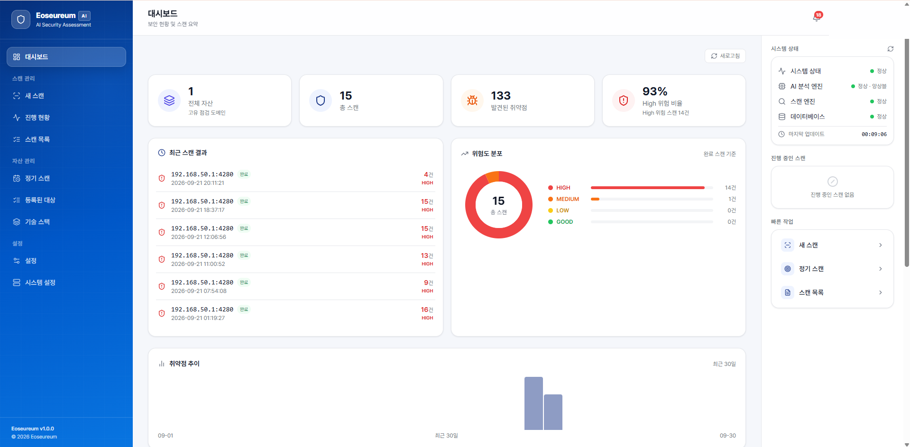
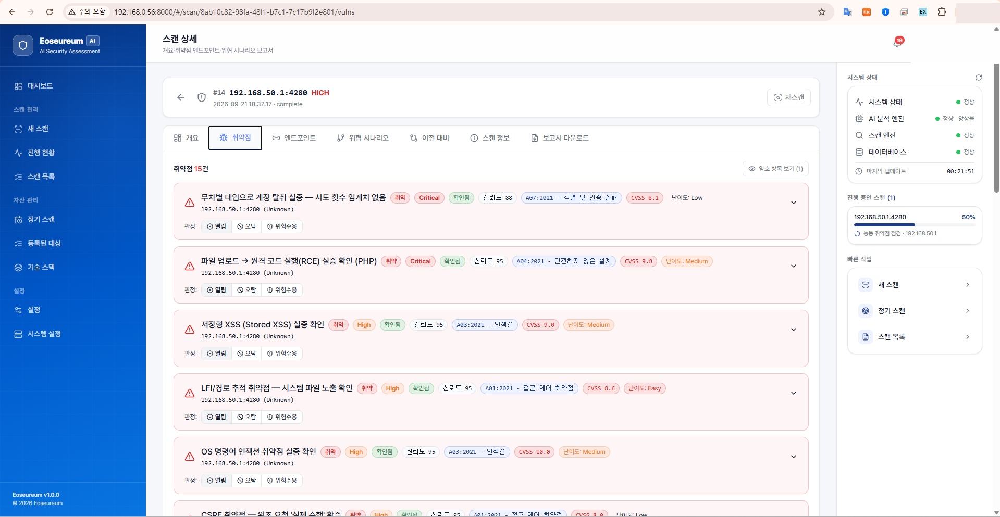
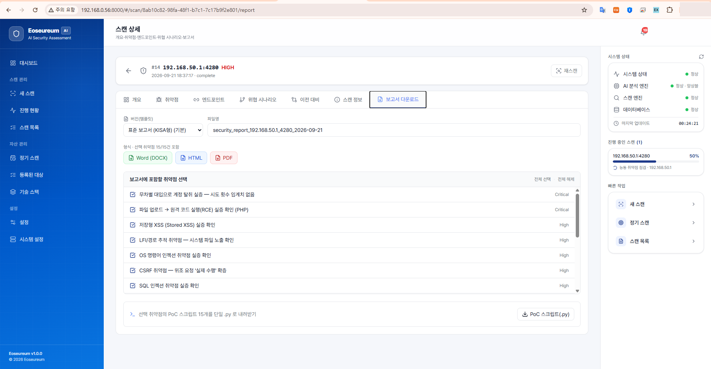

# 어스름 (Eoseureum) — AI 기반 능동 실증형 웹 취약점 발굴 시스템

> 로컬 AI 추론과 공격자 관점의 **자동 실증(PoC)** 을 결합한, 자체 구축 웹 애플리케이션 취약점 진단 시스템.
> 단순 탐지에서 멈추지 않고 **실제 악용 가능성을 능동적으로 증명**하며, 증거 기반 판정으로 오탐을 억제합니다.

---

## 핵심 특징

| | |
|---|---|
| **능동 실증 (Prove, don't punt)** | 후보 취약점을 "수동 검토"로 미루지 않고, 공격자 관점에서 자동 실증하여 **취약 확정 또는 폐기**로 판정. 예: 블라인드 SQLi는 참·거짓 응답 차등으로 데이터를 실제 추출(`@@version` 등)해 확증. |
| **로컬 AI 판단** | 외부 상용 LLM API를 쓰지 않고 **로컬 추론 런타임(Ollama)** 에서 오픈 모델을 역할별로 라우팅(분석·오탐판정·앙상블). 대상 데이터가 외부로 전송되지 않음. |
| **증거 기반 오탐 억제** | 정적 자산 오인·검증 불일치 등 전형적 오탐을 자동 억제. 판정은 `증거 → 판정 → 표현`을 분리하고, 다중 모델 앙상블로 교차 검증. |
| **탐지 기법 내재화** | 디렉터리 퍼징·핑거프린팅·파라미터 탐색 등을 자체 엔진으로 내재화하여 외부 도구 의존을 최소화(외부 도구는 선택적 보강). |
| **안전장치** | 점검 강도를 4단계 검증 프로파일(SAFE·STANDARD·ADVANCED·PROOF)로 분리하고, 적응형 속도 제어(AIMD)·비파괴 원칙·상태변경 원상복구를 적용. |

## 지원 취약점 (요약)

주입(SQLi 오류/블라인드/시간/OOB·SSTI·OS 명령·NoSQL), 클라이언트(반사/저장/DOM XSS·CSP 우회·CSRF), SSRF/OOB, 인증·권한(인증 우회·BAC/IDOR·취약 세션·브루트포스), 실행/업로드(RCE·역직렬화·JNDI), 정보 노출(민감 파일·오류·오픈 리다이렉트) 등 **약 50여 종**의 점검 기법을 지원하며 대부분 능동 실증까지 수행합니다.

## 화면

| 종합 대시보드 | 능동 실증 취약점 목록 | 자동 생성 보고서 |
|---|---|---|
|  |  |  |

## 아키텍처

```
대상 입력 → 크롤링·공격표면 발견 → 표면 정규화 → 탐지 엔진(프로브군)
        → AI 판단 → 능동 실증(PoC) → 증거·판정 → 보고서 생성
```

- **탐지·실증 엔진**: 취약점군별 능동 프로브 + 판정 규칙 + 실증·검증 프레임워크
- **AI 계층(전 단계 관통)**: 로컬 추론 모델로 발견 우선순위·컨텍스트 해석·페이로드 적응·보고서 총평 자동 생성
- **보고 계층**: 표준(KISA형) 보고서를 DOCX/HTML/PDF로 생성, 취약점별 재현 PoC 스크립트(.py) 내보내기

## 기술 스택

- **백엔드**: Python (FastAPI, 비동기 I/O) · aiosqlite · Playwright(헤드리스 브라우저)
- **프런트엔드**: React + Vite
- **AI**: Ollama 로컬 추론 (오픈 모델 역할별 라우팅)

## 설치 및 실행

> ⚠️ 인가된 본인 소유 대상 또는 취약 실습 앱에서만 사용하세요.

### 사전 준비
- Python 3.12+, Node.js 18+
- [Ollama](https://ollama.com) 설치 후 모델 pull (예: `ollama pull qwen2.5:14b`)
- 점검 대상: [DVWA](https://github.com/digininja/DVWA) 등 취약 실습 앱 권장

### 백엔드
```bash
cd backend
python -m venv .venv && source .venv/bin/activate
pip install -r requirements.txt
cp .env.example .env        # SECRET_KEY 등 값 채우기
uvicorn main:app --host 0.0.0.0 --port 8000
```

### 프런트엔드
```bash
cd frontend
npm install
npm run dev
```

### 기본 계정
최초 실행 시 관리자 계정이 생성됩니다: `admin` / `ChangeMe123!`
**최초 로그인 후 반드시 비밀번호를 변경하세요.**

### (선택) 외부 도구 보강
```bash
bash scripts/install_tools.sh   # testssl, nuclei, ghauri 등 선택적 설치
```

## 보안 및 면책

본 도구는 **인가된 대상에 대한 방어적 보안 진단** 목적으로만 사용해야 합니다. 파괴적 행위(DoS·데이터 삭제 등)는 설계상 범위에서 제외되며, 상태 변경 점검은 원상복구 또는 삭제 요청으로 처리됩니다. 무단 사용에 대한 책임은 사용자에게 있습니다.

## 라이선스

MIT License
